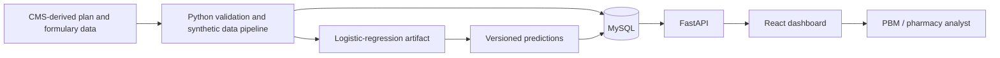

# Pharmacy Formulary Optimization and Adherence Assistant

A proof-of-concept analytics application that combines public CMS-derived plan and formulary attributes with synthetic member, medication, utilization, adherence, prescriber, and prediction data. A FastAPI service exposes chart-ready analytics to a React dashboard.

> [!IMPORTANT]
> This repository is a synthetic proof of concept. It does not contain real patient or prescriber records and must not be used for clinical decisions, medication-substitution guidance, causal conclusions, measured plan performance, or formulary recommendations.

## What the prototype demonstrates

- Plan-level formulary and adherence-risk analytics
- Versioned batch scoring through a fixed 12-feature contract
- Explainable synthetic prescriber review signals
- Plan, tier, restriction, pharmacy, cost-burden, and medication views
- A FastAPI backend, MySQL persistence layer, and React/Vite dashboard

The prescriber-analysis branch is separate from the adherence model: prescriber data is not an ML feature and does not retrain or alter the model.

## Architecture



For a detailed explanation, see [`docs/architecture.md`](docs/architecture.md) and the end-to-end handbook in `docs/`.

## Repository layout

```text
backend/
  app/               FastAPI application entry point
  core/              Configuration, logging, constants, and errors
  db/                MySQL session, health checks, and models
  ml/                Feature contract, validation, loading, and prediction
  model_artifacts/   Selected model pipeline and metadata
  repositories/      Parameterized database access
  routes/             HTTP endpoints
  schemas/            Request and response contracts
  scripts/            Verification, scoring, and aggregation commands
  services/           Application workflows
  sql/                Schema and analytics SQL
  tests/              Unit, integration, and API tests
frontend/
  src/                React application and API client
docs/                 Architecture and project handbook
.env.example          Safe configuration template
pytest.ini            Test configuration
```

## Prerequisites

- Python compatible with the serialized model artifact
- MySQL 8 or later
- Node.js 20 or later and npm

The supplied model was produced with Python 3.14.3, pandas 3.0.5, NumPy 2.5.2, scikit-learn 1.9.0, and joblib 1.5.3. Matching that environment is the safest option for model deserialization.

The database must contain the validated MVP v2.3 source tables/views expected by the backend. This repository includes backend schema and analytics SQL, but it is not a one-command database bootstrap from an empty MySQL instance.

## Local setup

### 1. Configure the backend

PowerShell:

```powershell
python -m venv .venv
.\.venv\Scripts\Activate.ps1
python -m pip install --upgrade pip
python -m pip install -r .\backend\requirements.txt
Copy-Item .\.env.example .\.env
```

macOS/Linux:

```bash
python -m venv .venv
source .venv/bin/activate
python -m pip install --upgrade pip
python -m pip install -r backend/requirements.txt
cp .env.example .env
```

Edit `.env` with your local MySQL credentials. Never commit `.env`.

Verify the database and model:

```bash
python -m backend.scripts.verify_database
python -m backend.scripts.verify_model
```

Start the API:

```bash
python -m uvicorn backend.app.main:app --reload --host 127.0.0.1 --port 8000
```

API documentation is available at <http://127.0.0.1:8000/docs> and health status at <http://127.0.0.1:8000/api/v1/health>.

### 2. Configure the frontend

In a second terminal:

```bash
cd frontend
npm install
npm run dev
```

Open <http://localhost:5173>. The frontend defaults to `http://127.0.0.1:8000/api/v1`. To use another API, create `frontend/.env.local` containing:

```text
VITE_API_BASE_URL=http://127.0.0.1:8000/api/v1
```

The archive contains both `package-lock.json` and `pnpm-lock.yaml`. Choose one package manager for the repository and remove the unused lockfile before accepting dependency updates.

## Database and scoring workflow

The SQL files in `backend/sql/` are numbered where ordering matters. Review each script against a backed-up database before applying it; some scripts expect source tables and views created by the upstream synthetic-data pipeline.

Validate a scoring cohort without writing:

```bash
python -m backend.scripts.score_dashboard_cohort --generation-version "mvp_v2.3" --dry-run
```

Persist a scoring run, predictions, and dashboard KPIs:

```bash
python -m backend.scripts.score_dashboard_cohort --generation-version "mvp_v2.3"
```

Refresh dashboard aggregations:

```bash
python -m backend.scripts.refresh_aggregations
```

## API overview

All application endpoints are prefixed with `/api/v1` by default.

| Method | Endpoint | Purpose |
|---|---|---|
| `GET` | `/health` | API and database health |
| `GET` | `/plans` | Available plans |
| `GET` | `/metadata/active-run` | Active dataset and model run |
| `POST` | `/scoring/batch` | Controlled batch scoring |
| `GET` | `/dashboard/plans/{plan_key}/summary` | Plan KPI summary |
| `GET` | `/dashboard/plans/compare` | Cross-plan comparison |
| `GET` | `/analytics/*` | Risk, tier, restriction, cost, pharmacy, medication, and opportunity analytics |
| `GET` | `/analytics/prescribers/*` | Synthetic prescriber summaries and review signals |
| `GET` | `/predictions` | Paginated prediction audit records |

Use the interactive OpenAPI page at `/docs` for the full, implementation-derived contract.

## Testing

Run the backend test suite from the repository root:

```bash
pytest -q
```

Build the frontend as a release check:

```bash
cd frontend
npm run build
```

Database integration tests require an accessible, correctly populated test database. Do not point tests that write data at a production database.

## Configuration

Configuration is loaded from the root `.env`. Important groups include:

- Application: `APP_ENV`, `API_PREFIX`, `LOG_LEVEL`, `CORS_ORIGINS`
- MySQL: `MYSQL_HOST`, `MYSQL_PORT`, `MYSQL_USER`, `MYSQL_PASSWORD`, `MYSQL_DATABASE`
- Model: `MODEL_PATH`, `MODEL_METADATA_PATH`, `MODEL_THRESHOLD`, `MODEL_RUN_NAME`
- Scoring: `GENERATION_VERSION`, `SCORING_BATCH_SIZE`
- Prescriber signals: `PRESCRIBER_MINIMUM_MEMBERS`, `PRESCRIBER_HIGH_TIER_THRESHOLD`, `PRESCRIBER_COST_BURDEN_THRESHOLD`

Use `.env.example` as the canonical safe template. Store deployed secrets in your hosting platform's secret manager.

## Data and model governance

- Public CMS-derived attributes and synthetic/derived fields must remain clearly labeled.
- Do not add PHI, real patient records, or real prescriber identifiers.
- Treat `.joblib` artifacts as executable inputs: load only trusted, reviewed artifacts.
- Record model, dataset, threshold, and aggregation versions with every published result.
- Review synthetic output for accidental sensitive-data inclusion before committing it.
- The model-development cohort must not be presented as unseen real-world performance.

## Known limitations

- Synthetic results do not establish clinical validity or causality.
- Review thresholds are demonstration settings, not clinical standards.
- Synthetic specialties are descriptive and are not clinically matched to drugs.
- There is no governed therapeutic-equivalence mapping, so the application does not recommend substitute medications.
- A fully populated MVP v2.3 database is required for the complete dashboard experience.

## Contributing and security

See [`CONTRIBUTING.md`](CONTRIBUTING.md) for the development workflow and [`SECURITY.md`](SECURITY.md) for responsible vulnerability reporting and healthcare-data precautions.

## License

No license has been selected. Add a `LICENSE` file before making the repository public or accepting external contributions. Until then, copyright remains with the repository owner and no reuse rights are granted by default.

