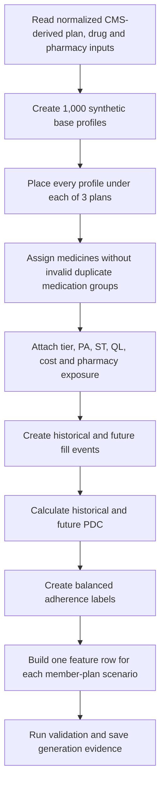
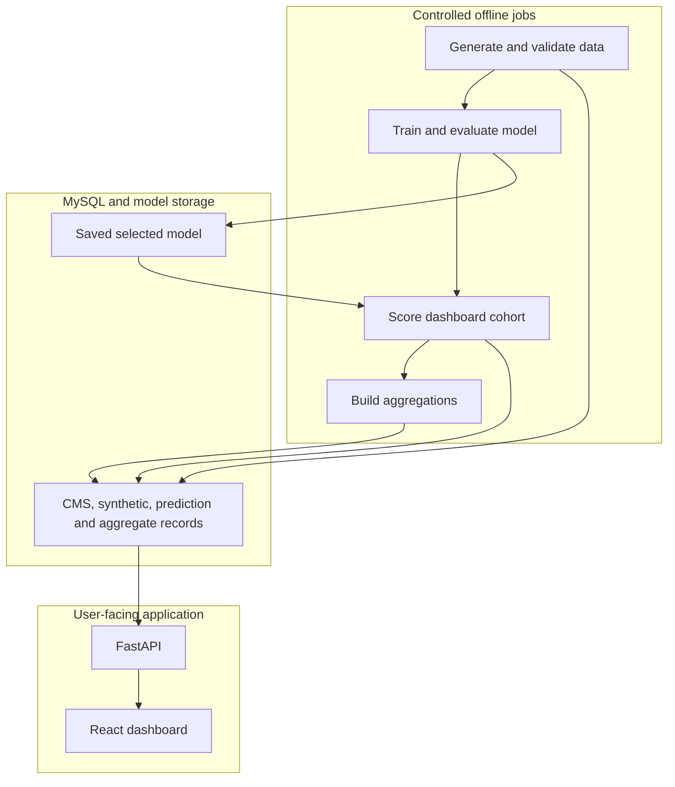
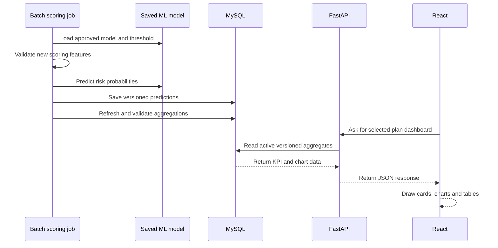

# Pharmacy Formulary Optimization and Adherence Assistant

## End-to-End Prototype Handbook in Simple English

**Prototype version:** MVP v2.3  
**Main technologies:** MySQL, Python, scikit-learn, FastAPI and React  
**Current data scale:** 1,000 synthetic base profiles × 3 plans = 3,000 member-plan scenarios  
**Purpose:** Demonstrate how formulary information, member history and plan-related barriers can be combined to find potential adherence-risk and formulary-review opportunities  
**Status:** Proof of concept only

---

## 1. The whole prototype in one simple story

Imagine that we have three medicine plans. Each plan has different rules and costs. One plan may place a medicine on a higher tier. Another plan may require prior authorization. A third plan may have a better pharmacy arrangement.

Now imagine 1,000 made-up people. We place each same person into all three plans. This gives us 3,000 “what-if” situations.

For every situation, we ask:

> “Based on this person’s past medicine behavior and the barriers in this plan, how likely is the person to become non-adherent?”

The machine-learning model gives a risk probability. For example:

```text
Person A under Plan 1: 28% predicted non-adherence risk
Person A under Plan 2: 61% predicted non-adherence risk
Person A under Plan 3: 43% predicted non-adherence risk
```

The system then combines thousands of individual predictions into simple plan-level numbers, charts and tables. A user selects a plan from a dropdown and sees where risk, high tiers, restrictions, cost burden or pharmacy barriers appear together.

The prototype does not make coverage decisions. It helps a reviewer know where to look more closely.

---

## 2. What problem are we trying to solve?

A formulary is a plan’s list of covered medicines. It is like a menu. The menu tells us:

- Which medicines are covered
- Which tier each medicine belongs to
- What cost-sharing may apply
- Whether prior authorization is needed
- Whether step therapy is needed
- Whether a quantity limit exists
- Which pharmacies are preferred or nonpreferred

These rules can create friction. “Friction” means something that may make it harder, slower or more expensive for a person to receive medicine.

Looking only at a formulary rule does not tell us whether people will actually have adherence problems. Looking only at past refill behavior also does not tell us whether a plan design may add difficulty.

Our revised approach brings both sides together:

1. The member side: age, health complexity, number of medicines and past refill behavior.
2. The plan side: tier, restrictions, cost burden and pharmacy access.
3. The model side: predicted probability of future non-adherence.
4. The dashboard side: plan-level and population-level summaries.

This is more aligned with the challenge because it connects formulary information with simulated medication-history and adherence signals.

---

## 3. What is the prototype trying to prove?

The prototype is trying to prove that a complete analytical workflow is possible:

1. Read real public plan and formulary information.
2. Create safe synthetic member and utilization data.
3. Build historical model features.
4. Train and evaluate machine-learning models.
5. Predict non-adherence risk for new synthetic scenarios.
6. Combine predictions into plan, tier, restriction, cost and pharmacy summaries.
7. Show the results in an interactive dashboard.
8. Highlight potential areas for human formulary review.

The prototype does **not** prove that a formulary caused non-adherence. It does **not** guarantee that a real formulary change is required. It produces decision-support signals for a synthetic demonstration.

The correct phrase is:

> “Potential Formulary Review Opportunity — Synthetic POC”

Avoid saying:

> “The model proves that this formulary must be changed.”

---

## 4. The most important words

| Word | Simple meaning |
|---|---|
| Formulary | The plan’s covered-medicine list and rules |
| Plan | A specific prescription-drug benefit option |
| Member | A person enrolled in a plan; synthetic in this prototype |
| Base profile | The plan-independent description of one made-up person |
| Member-plan scenario | One base profile placed under one plan |
| Matched profile | The same base profile compared under all three plans |
| Medication | One medicine used by a member |
| Fill event | One scheduled chance to refill a medicine |
| Adherence | Taking or refilling medicine as expected |
| PDC | Proportion of Days Covered; a measure of medicine availability over time |
| Feature | A piece of information given to the model |
| Label or target | The answer the model learns to predict |
| Probability | A number from 0 to 1 showing predicted risk |
| Prediction class | The final “adherent” or “non-adherent” prediction |
| Aggregation | Combining many rows into totals, averages and rates |
| KPI | A key number shown on the dashboard |
| API | A controlled doorway used by the frontend to ask the backend for data |
| POC | Proof of concept; a demonstration, not a production system |

---

## 5. Real data and synthetic data must stay separate

This distinction is central to the project.

### 5.1 Real public CMS-derived information

The plan/formulary side comes from approved public CMS sources. It includes items such as:

- Contract ID, plan ID and segment ID
- Plan name and formulary identifier
- Covered medicines and RxCUIs
- Tier placement
- Prior-authorization status
- Step-therapy status
- Quantity-limit status
- Beneficiary-cost fields from the approved source
- Pharmacy-network information
- Preferred or nonpreferred pharmacy status

This is real reference information about plans and formularies.

### 5.2 Synthetic information

The member and outcome side is invented for the prototype. It includes:

- Member IDs and base profiles
- Age and chronic-condition count
- Member ZIP code
- Medication assignment
- Pharmacy choice
- Refill completion and delay
- Historical and future PDC
- Synthetic cost-burden score
- Adherent/non-adherent outcome
- Model probability and predicted class

No real patient is represented.

### 5.3 Derived information

Some fields are calculated from other fields. For example:

- Historical missed-fill rate
- Mean tier level
- Prior-authorization exposure rate
- Average predicted risk
- Percentage of members flagged at risk

These are derived values. They are not raw CMS facts and they are not directly observed patient outcomes.

### 5.4 The rule for every screen and report

Every dashboard, report and presentation should say:

> Real public CMS plan/formulary/pharmacy attributes are combined with synthetic member, utilization, outcome and prediction data for a proof-of-concept demonstration.

---

## 6. Why do we use synthetic members?

Synthetic members are useful because they let us build and test the full system without using protected patient information.

They also let us create controlled examples. We can make sure the dataset contains:

- Enough members to train a model
- Both adherent and non-adherent outcomes
- Different levels of cost and formulary friction
- The same profiles under all plans
- Known relationships that the model can learn in a POC

The limitation is equally important: success on synthetic data does not tell us what performance will be on real patients.

---

## 7. The matched-profile design

We created 1,000 base profiles. A base profile describes the person before a plan is applied.

Each base profile appears under all three selected plans:

```text
1,000 base profiles × 3 plans = 3,000 member-plan scenarios
```

This is like testing the same toy car on three different roads. The car stays the same. The road changes. We can then ask whether the road conditions change the result.

In our prototype:

- The person’s core profile stays matched.
- Plan tier, restrictions, cost and pharmacy exposure may change.
- Historical and future synthetic behavior may respond to the scenario design.
- The model produces a risk estimate for each scenario.

The validated v2.3 data contains:

| Item | Count |
|---|---:|
| Base profiles | 1,000 |
| Member-plan scenarios | 3,000 |
| Member-medication rows | 5,343 |
| Fill-event rows | 64,116 |
| Model-feature rows | 3,000 |
| Adherent labels | 1,500 |
| Non-adherent labels | 1,500 |
| Profiles whose outcome changes across plans | 193 |

The 193 plan-sensitive profiles are useful. They show that plan context can make a difference for some matched synthetic profiles. They do not prove causation in the real world.

---

## 8. How the synthetic data is built

The synthetic generator works in stages.



### 8.1 Base profile

The generator first creates the made-up person. Example information includes age, chronic-condition count, medication count and a synthetic history tendency.

### 8.2 Plan scenario

The same profile is connected to one selected plan. The plan supplies the formulary and pharmacy context.

### 8.3 Medication rows

The person receives one or more medicines from the allowed medicine pool. Each medicine row receives its plan-specific tier, restrictions, pharmacy status and burden values.

### 8.4 Fill events

The generator creates scheduled refill opportunities. Each event can be completed, delayed or missed.

### 8.5 PDC and target

Future PDC is calculated from future fill events for the synthetic outcome:

```text
future PDC = completed future fills / scheduled future fills
```

The target is:

```text
non_adherent = 1 when future PDC < 0.80
non_adherent = 0 when future PDC >= 0.80
```

Future PDC is used to create and audit the label. It is never given to the model as an input.

---

## 9. Why are the classes balanced?

The target contains exactly:

```text
1,500 adherent scenarios
1,500 non-adherent scenarios
```

This is a 50/50 class balance.

Balanced classes help the POC because a model cannot get a high accuracy simply by guessing the largest class every time. It must learn useful patterns.

The balance is created during synthetic generation. It is not created by duplicating rows after the train/test split. This prevents accidental leakage and repeated examples.

Plan-level rates are also close to balanced:

| Plan | Non-adherent rate |
|---|---:|
| `S4802\|138\|000` | 47.7% |
| `S5884\|217\|000` | 53.3% |
| `S5921\|382\|000` | 49.0% |

---

## 10. Where the data lives in MySQL

Think of MySQL as a large, organized digital filing cabinet. Each table is one drawer. A row is one paper in the drawer. A column is one field on the paper.

### 10.1 Current v2.3 synthetic tables

| MySQL object | What one row means | Why it exists |
|---|---|---|
| `syn_base_profiles_v2_3` | One synthetic person before plan assignment | Stores matched plan-independent profile information |
| `syn_members_v2_3` | One base profile under one plan | Stores the 3,000 scenarios |
| `syn_member_medications_v2_3` | One medicine for one member-plan scenario | Stores medicine, tier, restriction, pharmacy and burden exposure |
| `syn_fill_events_v2_3` | One scheduled refill event | Stores refill completion, delay, gap and period |
| `syn_member_features_v2_3` | One scenario’s full derived feature and audit record | Stores historical features, future outcome and label for controlled validation |

### 10.2 Current views

| MySQL view | Purpose |
|---|---|
| `ml_adherence_audit_view_v2_3` | Audit-only outcome and generator checks; not used for model features |
| `ml_adherence_training_view_v2_3` | Leakage-safe source for model training |
| `ml_adherence_training_view` | Stable compatibility name pointing to the v2.3 training view |

### 10.3 What is a view?

A view is like a safe window into the filing cabinet. It shows only selected columns and rows.

The training view is important because it hides future outcome details and exposes only:

- Traceability fields
- The 12 approved predictors
- The `non_adherent` label

The model team can read the view directly or export it as a clean CSV.

---

## 11. The model-feature dataset

The validated model file contains 3,000 rows and 20 columns.

The columns have four different jobs.

### 11.1 Identity and traceability

- `member_id`
- `base_profile_id`
- `contract_id`
- `plan_id`
- `segment_id`
- `plan_key`
- `generation_version`

These help us identify, split and report the data. They are not primary model inputs.

### 11.2 The 12 model features

| Feature | Simple meaning | Why it may matter |
|---|---|---|
| `age` | The synthetic person’s age | Different age groups may have different medicine complexity |
| `chronic_condition_count` | Number of long-term conditions | More conditions can make medicine routines harder |
| `medication_count` | Number of medicines | More medicines can increase routine complexity |
| `historical_member_pdc` | Past medicine coverage rate | Strong past adherence often predicts future behavior |
| `historical_missed_fill_rate` | Share of past fills missed | More missed fills can signal higher future risk |
| `historical_mean_delay_days` | Average past refill delay | Longer delays can signal difficulty maintaining medicine supply |
| `mean_tier_level` | Average formulary tier across the person’s medicines | Higher tiers may represent more burden or cost exposure |
| `prior_authorization_rate` | Share of medicines requiring PA | More PA exposure can mean more administrative friction |
| `step_therapy_rate` | Share requiring step therapy | More step therapy can mean extra treatment steps |
| `quantity_limit_rate` | Share with quantity limits | Limits may create refill or supply friction |
| `nonpreferred_pharmacy_rate` | Share using a nonpreferred pharmacy | Nonpreferred use may bring higher cost or lower convenience |
| `mean_synthetic_cost_burden` | Average relative burden across medicines | Higher burden may make continued fills more difficult |

### 11.3 The label

`non_adherent` is the answer the model learns:

```text
0 = adherent
1 = non-adherent
```

### 11.4 The grouping key

`base_profile_id` keeps the three versions of the same profile together during model evaluation.

---

## 12. Features can influence one another

The model does not always look at one feature alone.

For example:

```text
High medication count
        +
High prior-authorization rate
        +
High cost burden
        =
Potentially more difficulty than any one item alone
```

Another example:

```text
Strong historical PDC
        +
Low missed-fill rate
        +
Low refill delay
        =
Usually a lower-risk historical pattern
```

Some features are related by design. For example, preferred-pharmacy rate and nonpreferred-pharmacy rate describe opposite sides of pharmacy choice. The approved model uses the nonpreferred rate so both are not supplied as duplicate information.

Feature importance is an association learned from synthetic data. It is not proof that changing one feature will cause a real person’s adherence to improve.

---

## 13. Leakage: the model must not see the answer

Imagine giving a child a math test while leaving the answer sheet open. The child may score very well, but the test is not fair.

Machine-learning leakage is the same problem. Leakage happens when the model receives information that contains or reveals the future answer.

The following must never be model inputs:

- `future_member_pdc`
- `non_adherent` as a feature
- Future fill counts
- Future refill results
- `mean_risk`
- `mean_miss_probability`
- Hidden generation tendency
- Random seeds
- Any post-outcome calculation

The v2.3 training view excludes these fields. The audit view may contain future information, so it must never replace the training view.

---

## 14. How model training works

Machine learning is like teaching with examples.

We show the model many rows containing:

```text
features → known synthetic answer
```

The model looks for patterns. Later, it receives only the features and estimates the answer.

```mermaid
flowchart LR
    A["Validated training view or CSV"] --> B["Separate features, target and groups"]
    B --> C["Create grouped development and test sets"]
    C --> D["Train and tune models only on development data"]
    D --> E["Compare models using grouped cross-validation"]
    E --> F["Lock model and decision threshold"]
    F --> G["Evaluate once on untouched test data"]
    G --> H["Register selected model and evidence"]
```



### 14.1 Development and test data

We use:

```text
800 base profiles × 3 plans = 2,400 development rows
200 base profiles × 3 plans =   600 test rows
```

The 600 test rows are not dashboard data. They are an exam for the model.

### 14.2 Why the split is grouped

All three plan scenarios for one base profile must go into the same partition.

Bad split:

```text
Profile 25 under Plan A → training
Profile 25 under Plan B → test
```

The model has already seen the same person, so the test may look better than it really is.

Correct split:

```text
Profile 25 under Plans A, B and C → all in training
or
Profile 25 under Plans A, B and C → all in test
```

### 14.3 Grouped cross-validation

Inside the development set, we perform five smaller practice exams. This is called five-fold grouped cross-validation.

The same base profile still stays together. We use the development folds to select model settings. We do not use the final test outcomes for tuning.

---

## 15. The models we compare

### 15.1 Dummy baseline

This model does not learn useful patterns. It provides a minimum reference. A real model should beat it.

Child-friendly example: it is like always guessing the most common answer.

### 15.2 Logistic Regression

Logistic Regression combines the features using learned weights and produces a probability.

Child-friendly example: imagine putting small plus and minus weights on a balance scale. Historical missed fills may push risk upward, while strong historical PDC may push risk downward.

Advantages:

- Simple
- Fast
- Easy to explain
- Good baseline for a balanced dataset

### 15.3 Decision Tree

A Decision Tree asks a sequence of questions.

Example:

```text
Is historical PDC low?
  Yes → Is cost burden high?
  No  → Is missed-fill rate high?
```

It is easy to visualize, but a very large tree can memorize the training data. We limit its depth and require enough samples in each leaf.

### 15.4 Random Forest

A Random Forest builds many decision trees and lets them vote.

Child-friendly example: instead of asking one student, we ask a whole classroom and combine the answers.

It can learn more complex patterns, but it can also overfit if it is not controlled.

### 15.5 Optional plan-aware model

An optional comparison may include `plan_key` directly. This tests whether knowing the plan identity adds value.

It should be reported separately. The main model should use the meaningful historical and plan-exposure features rather than simply memorizing average differences among three plan names.

---

## 16. What does the model output?

For every member-plan scenario, the model produces a probability:

```text
predicted_non_adherence_probability = 0.72
```

This means the model places the scenario at 72% predicted non-adherence risk within the synthetic POC.

The model also uses a decision threshold:

```text
if probability >= threshold:
    predicted class = non-adherent
else:
    predicted class = adherent
```

The threshold is chosen from development data. It may not always be exactly 0.50.

The probability is especially useful for the dashboard because it preserves more information than a simple yes/no label.

---

## 17. How we judge the model

Accuracy is useful, but it is not enough by itself.

| Measure | Simple meaning |
|---|---|
| Accuracy | How many total answers were correct |
| Balanced accuracy | Accuracy that gives both classes equal importance |
| Precision | Of those flagged at risk, how many were truly non-adherent in the synthetic test data |
| Recall | Of the truly non-adherent synthetic scenarios, how many were found |
| F1 score | A balance between precision and recall |
| ROC AUC | How well the model ranks higher-risk cases above lower-risk cases |
| Average precision | Ranking quality focused on the non-adherent class |
| Brier score | How close predicted probabilities are to the synthetic outcomes |
| Confusion matrix | Counts of correct and incorrect predictions by class |

The mentor-requested target is at least 80% accuracy for the POC. We can design enhanced synthetic patterns that support this demonstration, but we must report the result honestly:

> “Performance on enhanced synthetic POC data.”

We must not keep changing the test split until the accuracy becomes high. The split and test set must remain fixed.

---

## 18. How we check overfitting

Overfitting means the model memorizes practice examples but performs poorly on new examples.

Child-friendly example: a child memorizes the answers to one worksheet but cannot solve a new worksheet.

We check:

- Training performance
- Development cross-validation performance
- Final test performance
- The gaps among these results
- Very deep trees or tiny leaves
- Unstable plan-level results
- Unrealistically perfect scores

If training accuracy is much higher than validation or test accuracy, the model may be overfitting.

We reduce overfitting by:

- Using 1,000 base profiles instead of only 100
- Keeping matched profiles together
- Limiting tree depth
- Using minimum leaf sizes
- Applying Logistic Regression regularization
- Comparing multiple folds
- Evaluating once on an untouched test set
- Using an explicit feature allowlist

---

## 19. What happens after the model is selected?

The selected model and its preprocessing steps are saved together as a model artifact. We also save:

- Dataset hash
- Feature list
- Split assignments
- Random seed
- Model settings
- Threshold
- Python and library versions
- Overall metrics
- Plan-level metrics
- Model-selection reason

This information makes the model run reproducible.

After official evaluation is locked, a deployment copy of the selected model may be refitted on all 3,000 training scenarios. The official performance evidence still comes from the untouched 600-row test result.

---

## 20. Training data and dashboard data are different

Do not upload the same training rows and present their predictions as new dashboard results.

We need a separate dashboard-scoring cohort.

### Training cohort

- Has the 12 model features
- Has the `non_adherent` label
- Is used to teach and evaluate the model

### Dashboard-scoring cohort

- Contains new synthetic base profiles
- Uses the same feature names and definitions
- Includes the same three plans
- Does not need the future outcome label at scoring time
- Is passed through the already trained deployment model

The scoring cohort is like a new worksheet given after the lesson.

---

## 21. The complete technology stack

```mermaid
flowchart LR
    A["Public CMS-derived plan, formulary, cost and pharmacy inputs"] --> B["Python validation and synthetic generation"]
    B --> C["MySQL tables and leakage-safe training view"]
    C --> D["Python and scikit-learn model pipeline"]
    D --> E["Saved model and member-level predictions"]
    E --> F["MySQL aggregation tables or views"]
    F --> G["FastAPI backend"]
    G --> H["React dashboard"]
    H --> I["Human reviews potential opportunities"]
```



### 21.1 Python

Python is the main data and machine-learning language.

We use it to:

- Validate input files
- Generate synthetic profiles and events
- Load CSV files into MySQL
- Validate the model-feature dataset
- Train and compare models
- Save predictions and reports
- Score the separate dashboard cohort

### 21.2 pandas and NumPy

These Python libraries help work with tables and numbers.

Child-friendly example: they are like powerful spreadsheets controlled by code.

### 21.3 scikit-learn

scikit-learn supplies the machine-learning tools:

- Logistic Regression
- Decision Tree
- Random Forest
- Grouped data splitting
- Cross-validation
- Preprocessing pipelines
- Metrics
- Saved model artifacts

### 21.4 MySQL

MySQL stores organized relational data. It connects plan, member, medication, fill, feature, prediction and aggregation records using keys.

MySQL is used because:

- It can join related tables
- It checks keys and constraints
- It provides stable views
- It supports grouped summaries
- FastAPI can query it efficiently

### 21.5 FastAPI

FastAPI is the backend web service.

Child-friendly example: React is a customer, MySQL is the kitchen store, and FastAPI is the waiter. React asks for a plan summary. FastAPI gets the correct data and returns it in a clean package.

FastAPI should:

- Validate requests
- Read MySQL safely
- Return plan lists and KPI summaries
- Return chart-ready aggregated data
- Return model and dataset metadata
- Never expose database passwords
- Never accept raw SQL from the browser

### 21.6 React

React builds the interactive dashboard seen by the user.

React should:

- Show a plan dropdown
- Show KPI cards
- Draw charts and tables
- Apply user filters
- Display data/model version details
- Display the synthetic-POC disclaimer

React should not train the model or recreate business calculations. It should display results returned by FastAPI.

### 21.7 joblib model file

The selected scikit-learn pipeline can be saved as a `.joblib` file. This file contains the fitted preprocessing and model.

The backend or a batch scoring job loads this file and uses it to score new feature rows.

### 21.8 Optional Docker deployment

Docker can package MySQL, FastAPI and React into separate containers. This makes setup easier and keeps environments consistent.

Docker is useful, but it is not required to prove the core POC locally.

---

## 22. Recommended system architecture

The POC should use batch training and batch scoring.

“Batch” means we process a whole group at a controlled time instead of retraining whenever a user clicks the dashboard.



Why this is a good POC design:

- Dashboard pages load quickly.
- Results do not change during a presentation.
- Every result points to one dataset and model version.
- React does not need machine-learning libraries.
- A failed training job cannot break a dashboard request.

---

## 23. Runtime prediction flow

The preferred POC flow is:

1. Prepare a separate synthetic scoring cohort.
2. Validate that it has the same 12 feature definitions.
3. Load the saved model.
4. Calculate a probability and class for every scenario.
5. Save predictions with the model run ID.
6. Build plan and subgroup aggregations.
7. Mark the validated run as active.
8. FastAPI serves the active results.
9. React displays them.



---

## 24. What is aggregation?

The model predicts one row at a time. A pharmacy team normally wants to see the whole plan or a group of medicines.

Aggregation turns many small answers into a useful summary.

Example member-level predictions:

```text
Member 1 risk = 0.70
Member 2 risk = 0.40
Member 3 risk = 0.80
```

Plan average:

```text
average predicted risk = (0.70 + 0.40 + 0.80) / 3 = 0.6333
```

This can be shown as 63.3% average predicted non-adherence risk for the example population.

### 24.1 The counting rule

We must know what one row means before counting.

- Member KPI denominator: unique member-plan scenarios
- Medication KPI denominator: member-medication rows
- Fill KPI denominator: scheduled fill events
- Drug KPI denominator: unique scenarios exposed to that drug

If a member has three medications, joining predictions directly to medication rows creates three copies of that member’s prediction. We must deduplicate member counts or calculate medication-level metrics at the correct grain.

---

## 25. The aggregation architecture

Recommended dashboard-ready objects include:

| Aggregate | One row means | Dashboard use |
|---|---|---|
| `agg_plan_kpis` | One model run and one plan | KPI cards and dropdown summary |
| `agg_plan_risk_bands` | One plan and one risk band | Risk-distribution chart |
| `agg_plan_drug_kpis` | One plan and one medicine | Medication analysis table |
| `agg_plan_tier_kpis` | One plan and one tier | Tier-risk chart |
| `agg_plan_restriction_kpis` | One plan and one restriction type | PA/ST/QL chart |
| `agg_plan_cost_bands` | One plan and one burden band | Cost-burden chart |
| `agg_plan_pharmacy_kpis` | One plan and pharmacy status | Preferred/nonpreferred comparison |
| `agg_matched_plan_comparisons` | One profile and plan pair | Same-profile plan comparison |
| `agg_review_opportunities` | One plan and opportunity item | Prioritized review worklist |

At the current scale, SQL views can work. Persisted versioned aggregate tables are better for a stable demo because they are fast and reproducible.

---

## 26. Three important plan KPIs

### 26.1 Total members scored

Meaning: the number of synthetic member-plan scenarios included for the selected plan.

Example:

```text
Total members scored = 1,000
```

### 26.2 Members flagged at risk

Meaning: the number whose predicted probability is at or above the approved decision threshold.

Example:

```text
Members flagged at risk = 340
```

### 26.3 Percentage flagged at risk

Meaning: the share of scored members predicted to be at risk.

```text
percentage flagged = members flagged / total members × 100
```

Example:

```text
340 / 1,000 × 100 = 34%
```

### Average predicted risk is different

Average predicted risk is the average of all probabilities. It is not the same as percentage flagged.

Example:

```text
Member probabilities: 20%, 40%, 90%
Average predicted risk: 50%
```

If the classification threshold is 60%, only one of the three is flagged. Therefore:

```text
Percentage flagged = 33.3%
Average predicted risk = 50%
```

Both KPIs are useful, but they answer different questions.

---

## 27. Important analysis levels

### 27.1 Plan level

One selected plan across its entire synthetic population.

Question answered:

> “What does risk and formulary friction look like in this plan?”

### 27.2 Medication level

One specific medicine within a plan.

Question answered:

> “Among people exposed to this medicine, what tier, restriction, burden and predicted risk do we observe?”

Plan level and medication level are not the same. A plan contains many medicines. Medication analysis looks inside the plan.

### 27.3 Restriction level

Groups medicine exposures by PA, ST or QL status.

Question answered:

> “Do scenarios exposed to this type of restriction show different predicted risk?”

### 27.4 Tier level

Groups medicine exposures by formulary tier.

Question answered:

> “How do exposure and predicted risk vary from lower to higher tiers?”

### 27.5 Cost-burden level

Groups scenarios or medications into burden bands.

Question answered:

> “Where do higher burden and higher predicted risk appear together?”

### 27.6 Pharmacy-access level

Compares preferred and nonpreferred pharmacy exposure.

Question answered:

> “Does nonpreferred pharmacy use appear with different predicted risk or burden?”

### 27.7 Population level

The overall synthetic cohort across all selected plans, or the complete filtered population defined by the screen.

Question answered:

> “What is the big-picture result across the prototype population?”

Plan level is one plan. Population level can include all three plans. They are equal only when the selected population contains exactly one plan.

---

## 28. Preferred, nonpreferred and in-network pharmacies

### In-network pharmacy

The pharmacy participates in the plan’s network. The member can generally use plan benefits there according to plan rules.

### Preferred pharmacy

A preferred pharmacy is an in-network pharmacy where the plan may offer more favorable cost-sharing or arrangements.

### Nonpreferred pharmacy

A nonpreferred pharmacy can still be in-network, but it may have less favorable cost-sharing than a preferred pharmacy.

Simple relationship:

```text
In-network pharmacies
├── Preferred
└── Nonpreferred
```

“Nonpreferred” does not automatically mean “out of network.”

---

## 29. Recommended dashboard pages

### 29.1 Overview page

- Plan dropdown
- Total members scored
- Members flagged at risk
- Percentage flagged at risk
- Average predicted risk
- Risk-band chart
- Plan comparison chart
- Synthetic-data disclaimer

### 29.2 Plan detail page

- Selected plan name and IDs
- Tier breakdown
- PA, ST and QL exposure
- Cost-burden distribution
- Preferred/nonpreferred pharmacy comparison
- Top medications by exposure and risk
- Potential review-opportunity table

### 29.3 Medication page

- Medicine search
- Plan-specific tier and restrictions
- Exposed scenario count
- Mean predicted risk
- At-risk rate
- Mean cost burden
- Pharmacy context

### 29.4 Model transparency page

- Dataset version
- Model run ID
- Model type
- Feature list
- Excluded leakage fields
- Decision threshold
- Accuracy, precision, recall, F1, ROC AUC and calibration
- Baseline/model comparison
- Synthetic POC limitations

---

## 30. How the plan dropdown works

1. FastAPI returns the three available plans.
2. React fills the dropdown with plan names.
3. The user selects one plan.
4. React sends the selected `plan_key` to FastAPI.
5. FastAPI queries only the active aggregate rows for that plan and model run.
6. FastAPI returns KPI and chart data as JSON.
7. React updates all cards and charts.

The dropdown should use the composite plan key:

```text
contract_id | plan_id | segment_id
```

Example:

```text
S4802|138|000
```

The segment ID must remain text so `000` is not changed to `0`.

---

## 31. Recommended FastAPI endpoints

These are recommended prototype endpoints. Names can be adjusted to match the backend project.

| Endpoint | What it returns |
|---|---|
| `GET /api/v1/health` | Whether the API and database are ready |
| `GET /api/v1/metadata/active-run` | Active dataset, model and aggregation versions |
| `GET /api/v1/plans` | Dropdown plan list |
| `GET /api/v1/plans/{planKey}/summary` | KPI cards for one plan |
| `GET /api/v1/plans/compare` | Side-by-side plan results |
| `GET /api/v1/analytics/risk-distribution` | Risk-band chart data |
| `GET /api/v1/analytics/tiers` | Tier-level results |
| `GET /api/v1/analytics/restrictions` | PA/ST/QL results |
| `GET /api/v1/analytics/cost-burden` | Cost-burden results |
| `GET /api/v1/analytics/pharmacies` | Preferred/nonpreferred results |
| `GET /api/v1/drugs` | Filtered medication table |
| `GET /api/v1/opportunities` | Potential review-opportunity list |
| `GET /api/v1/models/{runId}/metrics` | Model evaluation results |

The API should return chart-ready data. React should not repeat the core aggregation calculations.

---

## 32. Recommended prediction and run records

Every prediction should be traceable to the data and model that created it.

Recommended prediction fields:

```text
model_run_id
dataset_version
member_id
base_profile_id
contract_id
plan_id
segment_id
plan_key
predicted_non_adherence_probability
decision_threshold
predicted_class
scored_at
```

Recommended run metadata:

```text
dataset hash
generation version
model artifact hash
model type
feature contract
hyperparameters
random seed
split assignment hash
threshold
test metrics
active/inactive status
```

This prevents the dashboard from mixing results from different data or model versions.

---

## 33. Potential review-opportunity logic

The model predicts adherence risk. It does not directly predict “change the formulary.”

The aggregation layer can create a transparent review-opportunity score using separate components:

```text
opportunity score
  = predicted-risk component
  + exposed-population component
  + formulary-friction component
  + burden component
```

Possible inputs include:

- Risk above the plan average
- Number of synthetic scenarios exposed
- High tier
- Prior authorization
- Step therapy
- Quantity limit
- Higher synthetic cost burden
- Nonpreferred pharmacy exposure
- Matched-profile risk difference across plans

The component weights must be visible and versioned. This score is a sorting tool for the POC, not a clinical recommendation or savings estimate.

---

## 34. Data and model validation gates

The system should stop when an important check fails.

### 34.1 Generation checks

- Exactly three selected plans
- Exactly 1,000 base profiles
- Exactly 3,000 scenarios
- Each profile appears under all three plans
- No invalid duplicate medication group within a profile
- Balanced labels
- Future PDC matches future fill events
- Target matches the PDC threshold
- Source hashes and seed recorded

### 34.2 MySQL checks

- Expected row counts
- No orphan medication records
- No orphan fill records
- No orphan feature records
- No duplicate scenario keys
- Correct version values
- Leading zeros preserved in identifiers

### 34.3 Model-data checks

- Exact 20-column clean schema
- Exact 12-feature allowlist
- No missing values
- No forbidden leakage fields
- Target contains only 0 and 1
- Every profile has three plan rows

### 34.4 Model checks

- No profile overlap between development and test
- Grouped cross-validation
- Baseline comparison
- Development/test performance gap reviewed
- Metrics reported overall and by plan
- Selected threshold comes from development data
- Final test used only after model selection

### 34.5 Aggregation checks

- 1,000 scenarios per plan for the current training design
- Plan populations reconcile with total population
- Risk-band totals equal plan population
- Flagged plus unflagged equals plan population
- Drug-level member counts are deduplicated
- Active dataset, model and aggregate versions match

---

## 35. Security and privacy for the POC

The current member data is synthetic, but good security habits are still important.

- Keep database passwords in environment variables.
- Do not commit passwords to source control.
- Give the React application no direct database access.
- Use parameterized SQL in FastAPI.
- Restrict FastAPI CORS to the React origin.
- Log model run IDs and request IDs, not secrets.
- Separate development, test and demo environments.
- Allow only controlled jobs to write training, prediction and aggregate data.

If real patient data is ever introduced, a separate privacy, security, governance and regulatory review is required. The synthetic POC controls are not enough for real patient data.

---

## 36. What the prototype can and cannot say

### The prototype can say

- The full data-to-dashboard workflow works.
- The model learned patterns in enhanced synthetic POC data.
- Matched synthetic profiles can be compared across three plans.
- Predicted risk can be aggregated by plan, medicine, tier, restriction, burden and pharmacy status.
- Potential review areas can be ranked transparently.

### The prototype cannot say

- A real patient will be adherent or non-adherent.
- A formulary restriction caused non-adherence.
- One plan is clinically better than another.
- CMS endorses the model or dashboard.
- A drug should be added, removed or moved to another tier.
- A restriction should be removed.
- The model will achieve the same accuracy on real-world data.
- A predicted review opportunity guarantees savings or better outcomes.

---

## 37. Suggested end-to-end demonstration

### Step 1: Explain the problem

“Formulary rules, member cost and medication history may all affect adherence. Today, these signals can be difficult to review together.”

### Step 2: Explain the data boundary

“The plan and formulary reference attributes come from public CMS data. The member, utilization and outcome data is synthetic.”

### Step 3: Explain matched profiles

“We created 1,000 made-up profiles and placed every profile under the same three plans. This creates 3,000 comparable what-if scenarios.”

### Step 4: Explain the model

“The model uses 12 historical and plan-exposure features to estimate synthetic future non-adherence risk. It never sees future PDC as an input.”

### Step 5: Explain fair evaluation

“We keep all three rows for one profile together, compare several algorithms and use an untouched grouped test set.”

### Step 6: Show the dashboard

Select a plan. Show:

- Total members scored
- Members flagged at risk
- Percentage flagged at risk
- Average predicted risk
- Tier and restriction exposure
- Cost and pharmacy patterns
- Medication-level opportunities

### Step 7: Compare plans

“Because the same profiles appear under all plans, we can compare predicted risk for matched profiles while the plan context changes.”

### Step 8: State the limitation

“These results demonstrate the analytical workflow using synthetic outcomes. They are not clinical evidence or a recommendation to change a formulary.”

---

## 38. Team responsibilities

| Team area | Main work |
|---|---|
| Data engineering | Prepare CMS inputs, run synthetic generator, load MySQL and validate data |
| ML team | Validate training view/CSV, split by profile, train models, evaluate and save artifacts |
| Backend team | Build FastAPI services, safe database queries, metadata and aggregation endpoints |
| Frontend team | Build React pages, dropdowns, KPI cards, charts, tables and disclaimers |
| QA team | Test counts, API contracts, charts, filters, leakage controls and reproducibility |
| Product/business team | Define KPI meaning, review-opportunity rules, demo story and acceptable wording |

---

## 39. Recommended implementation order

1. Freeze the data dictionary and metric definitions.
2. Keep the validated CMS-derived inputs unchanged.
3. Generate and validate v2.3 synthetic tables.
4. Load the versioned tables into MySQL.
5. Use `ml_adherence_training_view_v2_3` as the model source.
6. Train and evaluate the candidate models with a grouped split.
7. Register the selected model and test evidence.
8. Create a separate dashboard-scoring cohort.
9. Score the cohort and save versioned predictions.
10. Build and reconcile aggregation tables or views.
11. Build FastAPI endpoints.
12. Build React overview and plan-detail pages.
13. Add medication, restriction, cost and pharmacy views.
14. Add model transparency and limitation text.
15. Freeze one stable demo run.
16. Test the full path from plan dropdown to MySQL response.

---

## 40. Prototype success criteria

The POC is successful when it can show that:

- Real CMS-derived plan attributes remain clearly separated from synthetic member data.
- All 1,000 base profiles are matched across three plans.
- The feature dataset is balanced and leakage-safe.
- The ML models are compared using grouped evaluation.
- The selected model meets the agreed POC standard on the fixed synthetic test set.
- New dashboard profiles can be scored without retraining.
- Member predictions reconcile to plan-level totals.
- Plan, medication, tier, restriction, burden and pharmacy summaries are available.
- FastAPI returns consistent versioned data.
- React presents clear KPIs, charts and disclaimers.
- Potential review opportunities are traceable and transparently calculated.
- No output is presented as real clinical evidence or a guaranteed formulary action.

---

## 41. Frequently asked questions

### Is the training view enough for model development?

Yes. `ml_adherence_training_view_v2_3` contains traceability fields, the 12 approved features and the target. The ML code must still exclude identifiers from the feature matrix.

### Should we use the same rows for the dashboard?

No. Create a separate synthetic scoring cohort with the same feature contract.

### If the dashboard cohort is separate, do we still need the 600-row test set?

Yes. The test set measures model performance. The dashboard cohort demonstrates scoring and visualization.

### Are plan level and medication level the same?

No. Plan level summarizes the whole plan. Medication level examines one medicine inside that plan.

### Are plan level and population level the same?

Only when the selected population contains one plan. Population level may combine all three plans.

### Is a nonpreferred pharmacy out of network?

Not necessarily. A nonpreferred pharmacy may still be in network but have less favorable arrangements than a preferred pharmacy.

### Does average predicted risk mean the percentage flagged?

No. Average risk is the mean probability. Percentage flagged is the share above the classification threshold.

### Does 80% accuracy prove the model is ready for real patients?

No. It only meets the agreed enhanced-synthetic POC demonstration criterion.

### Does the model guarantee a formulary review?

No. It helps prioritize potential areas for human review.

### Does the model decide which plan a member should choose?

No. That is outside the POC scope.

---

## 42. Required disclaimer

> This prototype combines real public CMS-derived plan, formulary, beneficiary-cost and pharmacy-network attributes with synthetic member, medication, utilization, cost-burden, adherence and prediction data. It demonstrates a proof-of-concept analytical workflow. The results do not represent real patients, measured plan performance, clinical evidence, official CMS quality measures, causal effects, guaranteed formulary-review needs or recommendations to change coverage or formulary policy.

---

## 43. Final plain-English summary

We start with real public information about three medicine plans. We create 1,000 made-up people and place each person under every plan. We create synthetic medicines and refill histories. We calculate a future synthetic adherence answer.

We give the model only information it would be allowed to know before that future answer. We keep copies of the same person together during training and testing. We compare simple and more complex models. We choose a model using fair grouped evaluation.

Next, we create a new synthetic dashboard cohort. The saved model predicts risk for each new member-plan scenario. MySQL stores the predictions. Aggregation logic combines the predictions into plan, medicine, tier, restriction, burden and pharmacy summaries. FastAPI safely delivers these summaries. React shows them as dropdowns, KPI cards, charts and tables.

The final output is not an automatic formulary decision. It is a clear, traceable POC that shows how a pharmacy team could use combined plan and adherence-risk signals to decide where human review may be useful.
